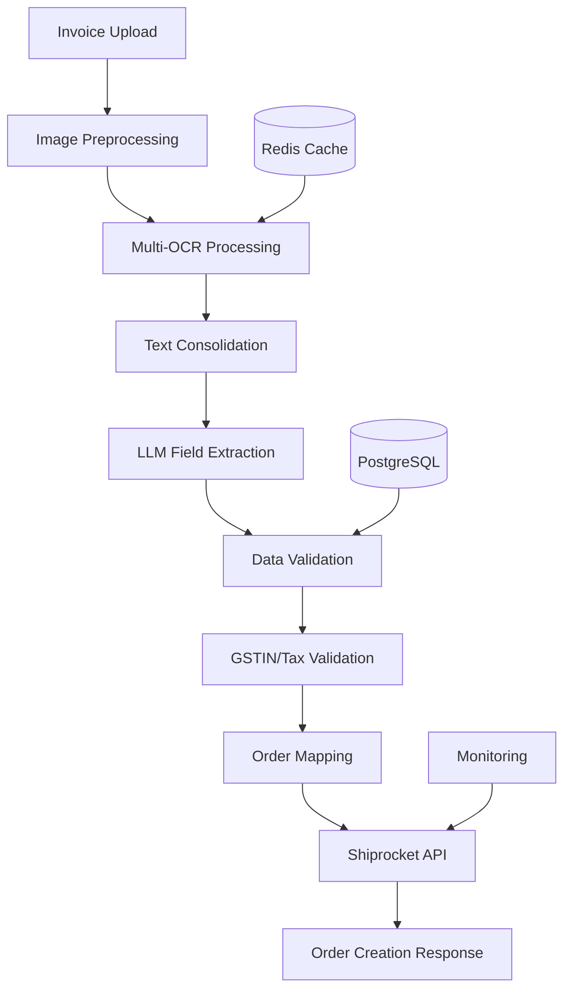

# Intelligent Invoice to Order Creation System
## Technical Stack & Implementation Guide

## 🎯 Project Overview
Transform B2B invoice images/PDFs into automated order creation using OCR + LLM technology for Shiprocket integration.

## 🏗️ Recommended Technology Stack

### 1. **OCR Solutions (High Accuracy)**

#### **Primary Recommendation: Multi-OCR Approach**
```python
# Combination for maximum accuracy
1. PaddleOCR (Best for mixed language support)
2. EasyOCR (Excellent for handwritten text)
3. Tesseract with preprocessing (Fallback)
4. AWS Textract (Cloud option for complex layouts)
```

#### **Cloud OCR APIs (Premium Options)**
- **Google Cloud Vision API** - Superior accuracy for printed text
- **AWS Textract** - Excellent for forms and tables
- **Azure Computer Vision** - Great for invoice-specific layouts
- **Microsoft Form Recognizer** - Specialized for structured documents

### 2. **Large Language Models (LLM)**

#### **Primary Recommendation: GPT-4 Turbo**
```python
# Best for field extraction and validation
- OpenAI GPT-4 Turbo (Latest)
- OpenAI GPT-4 Vision (For image + text analysis)
- Claude 3.5 Sonnet (Alternative with high accuracy)
```

#### **Local/Open Source Options**
```python
- Llama 3.1 (70B/8B) via Ollama
- Mistral 7B/22B
- Code Llama for structured data extraction
```

### 3. **Backend Framework**
```python
# Recommended: FastAPI
- FastAPI (Modern, async, auto-documentation)
- Pydantic (Data validation & serialization)
- SQLAlchemy (ORM)
- Alembic (Database migrations)
```

### 4. **Image Processing & Computer Vision**
```python
# Core Libraries
- OpenCV (Image preprocessing)
- Pillow (PIL) (Image manipulation)
- pdf2image (PDF to image conversion)
- numpy (Numerical operations)
- scikit-image (Advanced image processing)
```

### 5. **Database Solutions**
```python
# Primary: PostgreSQL
- Structured invoice data
- Order tracking
- User management

# Secondary: Redis
- Caching OCR results
- Session management
- Rate limiting
```

### 6. **Additional AI/ML Libraries**
```python
# Text Processing
- spaCy (NLP, Named Entity Recognition)
- regex (Advanced pattern matching)
- fuzzywuzzy (Fuzzy string matching)
- dateutil (Date parsing)

# Validation
- python-gstin (GSTIN validation)
- phonenumbers (Phone number validation)
```

## 🏢 System Architecture



## 📋 Implementation Steps

### Phase 1: Core OCR Engine Setup

#### 1.1 Environment Setup
```bash
# Create virtual environment
python -m venv invoice_ocr_env
source invoice_ocr_env/bin/activate  # On Windows: invoice_ocr_env\Scripts\activate

# Install core dependencies
pip install fastapi uvicorn python-multipart
pip install opencv-python pillow pdf2image
pip install paddlepaddle paddleocr easyocr pytesseract
pip install openai anthropic  # For LLM APIs
pip install sqlalchemy psycopg2-binary alembic
pip install redis pydantic python-dotenv
```

#### 1.2 OCR Service Implementation
```python
# ocr_service.py
import cv2
import numpy as np
from paddleocr import PaddleOCR
import easyocr
import pytesseract
from PIL import Image
import logging

class MultiOCRService:
    def __init__(self):
        self.paddle_ocr = PaddleOCR(use_angle_cls=True, lang='en')
        self.easy_reader = easyocr.Reader(['en'])
        
    def preprocess_image(self, image_path):
        """Advanced image preprocessing for better OCR accuracy"""
        img = cv2.imread(image_path)
        
        # Convert to grayscale
        gray = cv2.cvtColor(img, cv2.COLOR_BGR2GRAY)
        
        # Noise removal
        denoised = cv2.fastNlMeansDenoising(gray)
        
        # Contrast enhancement
        clahe = cv2.createCLAHE(clipLimit=2.0, tileGridSize=(8,8))
        enhanced = clahe.apply(denoised)
        
        # Deskewing (if needed)
        coords = np.column_stack(np.where(enhanced > 0))
        angle = cv2.minAreaRect(coords)[-1]
        if angle < -45:
            angle = -(90 + angle)
        else:
            angle = -angle
            
        if abs(angle) > 0.5:  # Only deskew if angle is significant
            (h, w) = enhanced.shape[:2]
            center = (w // 2, h // 2)
            M = cv2.getRotationMatrix2D(center, angle, 1.0)
            enhanced = cv2.warpAffine(enhanced, M, (w, h), flags=cv2.INTER_CUBIC, borderMode=cv2.BORDER_REPLICATE)
        
        return enhanced
    
    def extract_text_multi_ocr(self, image_path):
        """Use multiple OCR engines and consolidate results"""
        preprocessed_img = self.preprocess_image(image_path)
        
        results = {}
        
        # PaddleOCR
        try:
            paddle_result = self.paddle_ocr.ocr(preprocessed_img, cls=True)
            results['paddle'] = self.parse_paddle_result(paddle_result)
        except Exception as e:
            logging.error(f"PaddleOCR failed: {e}")
            results['paddle'] = ""
        
        # EasyOCR
        try:
            easy_result = self.easy_reader.readtext(preprocessed_img)
            results['easy'] = self.parse_easy_result(easy_result)
        except Exception as e:
            logging.error(f"EasyOCR failed: {e}")
            results['easy'] = ""
        
        # Tesseract (with custom config)
        try:
            custom_config = r'--oem 3 --psm 6 -c tessedit_char_whitelist=0123456789ABCDEFGHIJKLMNOPQRSTUVWXYZabcdefghijklmnopqrstuvwxyz@.-:,/() '
            tess_result = pytesseract.image_to_string(preprocessed_img, config=custom_config)
            results['tesseract'] = tess_result
        except Exception as e:
            logging.error(f"Tesseract failed: {e}")
            results['tesseract'] = ""
        
        return self.consolidate_ocr_results(results)
```

### Phase 2: LLM Integration for Field Extraction

#### 2.1 LLM Service Setup
```python
# llm_service.py
import openai
from typing import Dict, Any
import json
from pydantic import BaseModel

class InvoiceFields(BaseModel):
    # Billing Information
    billing_customer_name: str
    billing_address: str
    billing_city: str
    billing_state: str
    billing_pincode: str
    billing_phone: str
    billing_email: str
    billing_gstin: str
    
    # Shipping Information
    shipping_customer_name: str
    shipping_address: str
    shipping_city: str
    shipping_state: str
    shipping_pincode: str
    shipping_phone: str
    shipping_email: str
    
    # Order Information
    order_date: str
    invoice_number: str
    order_items: list
    sub_total: float
    tax_amount: float
    total_amount: float
    payment_method: str

class LLMInvoiceProcessor:
    def __init__(self, api_key: str):
        self.client = openai.OpenAI(api_key=api_key)
    
    def extract_invoice_fields(self, ocr_text: str) -> Dict[str, Any]:
        """Use GPT-4 to extract structured data from OCR text"""
        
        system_prompt = """
        You are an expert invoice data extraction AI. Extract the following information from the invoice text:

        REQUIRED FIELDS:
        1. Billing Information: Name, Address, City, State, PIN, Phone, Email, GSTIN
        2. Shipping Information: Name, Address, City, State, PIN, Phone, Email
        3. Invoice Details: Invoice Number, Date, Payment Method
        4. Items: Product Name, Quantity, Unit Price, Total Price, HSN Code, Tax Rate
        5. Totals: Subtotal, Tax Amount, Total Amount

        VALIDATION RULES:
        - GSTIN must be 15 characters (format: 22AAAAA0000A1Z5)
        - PIN codes must be 6 digits (Indian format)
        - Phone numbers should be 10 digits
        - Email must be valid format
        - Dates in YYYY-MM-DD format
        - All amounts as numbers only

        RESPONSE FORMAT: Return valid JSON only, no explanations.
        """
        
        user_prompt = f"""
        Extract invoice information from this text:
        
        {ocr_text}
        
        Return the data in this exact JSON structure:
        {{
            "billing_customer_name": "",
            "billing_address": "",
            "billing_city": "", 
            "billing_state": "",
            "billing_pincode": "",
            "billing_phone": "",
            "billing_email": "",
            "billing_gstin": "",
            "shipping_customer_name": "",
            "shipping_address": "",
            "shipping_city": "",
            "shipping_state": "",
            "shipping_pincode": "",
            "shipping_phone": "",
            "shipping_email": "",
            "order_date": "",
            "invoice_number": "",
            "order_items": [
                {{
                    "name": "",
                    "units": 0,
                    "selling_price": 0,
                    "hsn": "",
                    "tax_rate": 0,
                    "weight": 1
                }}
            ],
            "sub_total": 0,
            "tax_amount": 0,
            "total_amount": 0,
            "payment_method": ""
        }}
        """
        
        try:
            response = self.client.chat.completions.create(
                model="gpt-4-turbo-preview",
                messages=[
                    {"role": "system", "content": system_prompt},
                    {"role": "user", "content": user_prompt}
                ],
                temperature=0.1,
                max_tokens=2000
            )
            
            result = json.loads(response.choices[0].message.content)
            return result
            
        except Exception as e:
            raise Exception(f"LLM processing failed: {e}")
```

### Phase 3: Data Validation & Business Logic

#### 3.1 Validation Service
```python
# validation_service.py
import re
import phonenumbers
from datetime import datetime
import requests

class InvoiceValidator:
    
    def validate_gstin(self, gstin: str) -> bool:
        """Validate GSTIN format and checksum"""
        if not gstin or len(gstin) != 15:
            return False
        
        # GSTIN format: 22AAAAA0000A1Z5
        pattern = r'^[0-9]{2}[A-Z]{5}[0-9]{4}[A-Z]{1}[1-9A-Z]{1}[Z]{1}[0-9A-Z]{1}$'
        return bool(re.match(pattern, gstin))
    
    def validate_pincode(self, pincode: str) -> bool:
        """Validate Indian PIN code"""
        if not pincode:
            return False
        return bool(re.match(r'^[1-9][0-9]{5}$', pincode))
    
    def validate_phone(self, phone: str, country: str = 'IN') -> bool:
        """Validate phone number"""
        try:
            phone_obj = phonenumbers.parse(phone, country)
            return phonenumbers.is_valid_number(phone_obj)
        except:
            return False
    
    def validate_email(self, email: str) -> bool:
        """Validate email format"""
        pattern = r'^[a-zA-Z0-9._%+-]+@[a-zA-Z0-9.-]+\.[a-zA-Z]{2,}$'
        return bool(re.match(pattern, email))
    
    def validate_state_city(self, state: str, city: str) -> bool:
        """Validate state and city combination (can integrate with external API)"""
        # You can integrate with external APIs for validation
        indian_states = [
            'Delhi', 'Maharashtra', 'Karnataka', 'Tamil Nadu', 'Gujarat',
            'Rajasthan', 'Uttar Pradesh', 'West Bengal', 'Madhya Pradesh',
            # Add more states as needed
        ]
        return state in indian_states
    
    def validate_invoice_data(self, data: dict) -> tuple:
        """Comprehensive validation of extracted invoice data"""
        errors = []
        warnings = []
        
        # Required field validation
        required_fields = ['billing_customer_name', 'billing_address', 'billing_pincode']
        for field in required_fields:
            if not data.get(field):
                errors.append(f"Missing required field: {field}")
        
        # GSTIN validation
        if data.get('billing_gstin') and not self.validate_gstin(data['billing_gstin']):
            errors.append("Invalid GSTIN format")
        
        # Pincode validation
        if data.get('billing_pincode') and not self.validate_pincode(data['billing_pincode']):
            errors.append("Invalid billing pincode")
        
        # Phone validation
        if data.get('billing_phone') and not self.validate_phone(data['billing_phone']):
            warnings.append("Invalid phone number format")
        
        # Email validation
        if data.get('billing_email') and not self.validate_email(data['billing_email']):
            warnings.append("Invalid email format")
        
        # Amount validation
        if data.get('sub_total', 0) <= 0:
            errors.append("Invalid subtotal amount")
        
        return errors, warnings
```

### Phase 4: Shiprocket Integration

#### 4.1 Shiprocket API Service
```python
# shiprocket_service.py
import requests
from typing import Dict, Any
import logging
from datetime import datetime

class ShiprocketAPI:
    def __init__(self, email: str, password: str):
        self.base_url = "https://apiv2.shiprocket.in/v1"
        self.email = email
        self.password = password
        self.auth_token = None
        self.authenticate()
    
    def authenticate(self) -> bool:
        """Authenticate with Shiprocket API"""
        url = f"{self.base_url}/auth/login"
        payload = {
            "email": self.email,
            "password": self.password
        }
        
        try:
            response = requests.post(url, json=payload)
            response.raise_for_status()
            
            data = response.json()
            self.auth_token = data.get('token')
            return True
            
        except Exception as e:
            logging.error(f"Authentication failed: {e}")
            return False
    
    def create_order_from_invoice(self, invoice_data: dict) -> Dict[str, Any]:
        """Create Shiprocket order from invoice data"""
        
        if not self.auth_token:
            raise Exception("Not authenticated with Shiprocket")
        
        # Map invoice data to Shiprocket order format
        order_payload = {
            "order_id": f"INV_{invoice_data.get('invoice_number', datetime.now().strftime('%Y%m%d%H%M%S'))}",
            "order_date": invoice_data.get('order_date', datetime.now().strftime('%Y-%m-%d')),
            "channel_id": "",
            
            # Billing Information
            "billing_customer_name": invoice_data.get('billing_customer_name', ''),
            "billing_address": invoice_data.get('billing_address', ''),
            "billing_city": invoice_data.get('billing_city', ''),
            "billing_state": invoice_data.get('billing_state', ''),
            "billing_country": "India",
            "billing_pincode": invoice_data.get('billing_pincode', ''),
            "billing_email": invoice_data.get('billing_email', ''),
            "billing_phone": invoice_data.get('billing_phone', ''),
            "billing_isd_code": "+91",
            
            # Shipping Information (default to billing if not provided)
            "shipping_is_billing": 1 if not invoice_data.get('shipping_address') else 0,
            "shipping_customer_name": invoice_data.get('shipping_customer_name') or invoice_data.get('billing_customer_name', ''),
            "shipping_address": invoice_data.get('shipping_address') or invoice_data.get('billing_address', ''),
            "shipping_city": invoice_data.get('shipping_city') or invoice_data.get('billing_city', ''),
            "shipping_state": invoice_data.get('shipping_state') or invoice_data.get('billing_state', ''),
            "shipping_country": "India",
            "shipping_pincode": invoice_data.get('shipping_pincode') or invoice_data.get('billing_pincode', ''),
            "shipping_email": invoice_data.get('shipping_email') or invoice_data.get('billing_email', ''),
            "shipping_phone": invoice_data.get('shipping_phone') or invoice_data.get('billing_phone', ''),
            
            # Order Items
            "order_items": self.format_order_items(invoice_data.get('order_items', [])),
            
            # Payment and Totals
            "payment_method": invoice_data.get('payment_method', 'prepaid').lower(),
            "sub_total": invoice_data.get('sub_total', 0),
            "total_discount": 0,
            "shipping_charges": 0,
            "giftwrap_charges": 0,
            "transaction_charges": 0,
            
            # Package Details (estimated)
            "weight": self.calculate_total_weight(invoice_data.get('order_items', [])),
            "length": 10,  # Default values - can be enhanced
            "breadth": 10,
            "height": 10,
            
            # Additional Fields
            "pickup_location": "Primary",  # This should be configured
            "customer_gstin": invoice_data.get('billing_gstin', ''),
            "is_order_revamp": 1,
            "is_document": 0,
            "is_web": 1,
            "is_send_notification": True,
            "is_insurance_opt": 0,
            "currency": "INR"
        }
        
        # Create order via API
        url = f"{self.base_url}/orders/create/adhoc"
        headers = {
            "Authorization": f"Bearer {self.auth_token}",
            "Content-Type": "application/json"
        }
        
        try:
            response = requests.post(url, json=order_payload, headers=headers)
            response.raise_for_status()
            
            return response.json()
            
        except Exception as e:
            logging.error(f"Order creation failed: {e}")
            raise Exception(f"Failed to create order: {e}")
    
    def format_order_items(self, items: list) -> list:
        """Format items for Shiprocket API"""
        formatted_items = []
        
        for item in items:
            formatted_item = {
                "name": item.get('name', 'Product'),
                "selling_price": str(item.get('selling_price', 0)),
                "units": item.get('units', 1),
                "sku": item.get('sku', item.get('name', 'SKU001')),
                "hsn": item.get('hsn', ''),
                "weight": item.get('weight', 1),
                "category_name": None,
                "tax": item.get('tax_rate', None),
                "discount": None,
                "product_description": None
            }
            formatted_items.append(formatted_item)
        
        return formatted_items
    
    def calculate_total_weight(self, items: list) -> float:
        """Calculate total weight of all items"""
        total_weight = 0
        for item in items:
            weight = item.get('weight', 1)
            quantity = item.get('units', 1)
            total_weight += weight * quantity
        
        return max(total_weight, 0.5)  # Minimum 0.5kg
```

## 🚀 Future Enhancements

1. **Multi-language Support**: Add support for regional languages
2. **Machine Learning Pipeline**: Train custom models for field extraction
3. **Real-time Processing**: WebSocket-based live processing
4. **Mobile App Integration**: React Native/Flutter app
5. **Batch Processing**: Handle multiple invoices simultaneously
6. **Advanced Analytics**: Dashboard with processing statistics
7. **Integration APIs**: Connect with other e-commerce platforms

## 📞 Support & Maintenance

### Setup Instructions:
1. Clone repository and install dependencies
2. Configure environment variables
3. Set up PostgreSQL and Redis
4. Run database migrations
5. Start the FastAPI server
6. Test with sample invoice images

This comprehensive solution provides enterprise-grade invoice processing with high accuracy OCR, intelligent field extraction, and seamless Shiprocket integration. 